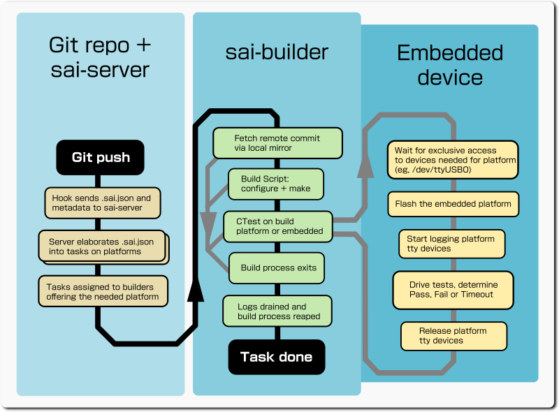
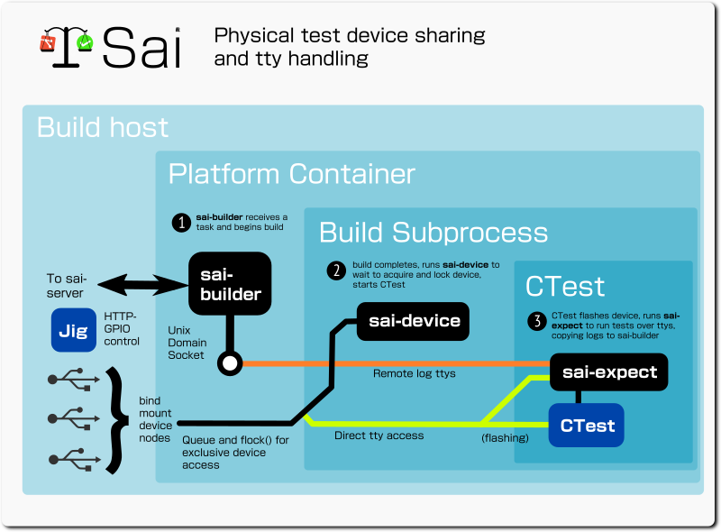

`Sai` (pronouced like 'sigh', "Trial" in Japanese) is a very lightweight
network-aware distributed CI builder and coordinating server.  It knows how to
use `systemd-nspawn` and `overlayfs` to build remote git repos on a variety of
distro versions very cheaply.

On small targets, it can also build on the host rootfs directly, and can also
run on an RPi3-class 'buddy' to flash and collect results (eg, over serial, or
gpio) from even smaller targets.

A self-assembling constellation of Sai Builder clients make their own
connections to one or more Sai Servers, who then receive hook notifications,
read JSON from the project describing what set of build variations and tests it
should run on which platforms, and distributes work concurrently over idle
builders that have the required environment.  A parallel Sai-web server is
available usually on :443 or via a proxy to provide a live web / websockets
interface with synamic updates and realtime build logs.


## General approach

 - Distributed "builders" run the `sai-builder` daemon from inside the build
   platform they want to provide builds for (ie, inside a systemd-nspawn or VM).

 - The `sai-builder` daemons maintain nailed-up outgoing client wss connections
   to a central `sai-server`, which manages the ad-hoc collection of builders
   it finds, and provides a web UI (http/2 and wss2).


 - When a git repo that wants sai tests is updated, a push hook performs a POST
   notiftying the Sai server of a new push event which creates an entry in an
   event sqlite3 database.  (The server does not need to access the repo that
   sends the git notification).  The hook sends the server information about the
   push and the revision of `.sai.json` from the new commit in the POST body...
   the server parses that JSON to fill an sqlite3 database with tasks and
   commandline options for the build on platforms mentioned in `.sai.json`.
   Pushes to branches beginning with `_` are ignored by Sai, even if they have
   a valid `.sai.json`; this allows casual sharing of trees via the same git
   repo during intense development without continually triggering CI builds.

 - Builders typically build many variations of the same push, so they use a
   local git mirror only on the builder to reduce the load on the repo that
   was updated.  For large trees, being able to already have previous trees
   as a starting point for git dramatically reduces the time compared to a full
   git fetch.

 - The server hands out waiting tasks on connected idle builders that offer the
   requested platforms, which build them concurrently.  The builders may be
   inside a protected network along with the repos they connect to; both the
   builders and the repo only make outgoing https or wss connections to the
   server.

 - On the builders, result channels (like stdout, stderr, eventually others like
   `/dev/acm0`) with logs and results are streamed back to the server over a wss
   link as the build proceeds, and are stored in an event-specific sqlite3
   database for scalability.

 - Builders can run CTest or other tests after the build and collect the
   results (CTest has the advantages it's lightweight and crossplatform).

 - The server makes human readable current and historical results available
   in realtime over https web interface

 - One `sai-builder` daemon can be configured to offer multiple instances of
   independent platform build, and multiple platform builds (eg, cross
   toolchains).

 - Embedded test devices that need management by external gpios to select
   flash or test modes can be wired to an RPi or similar running sai-jig.
   This listens on a configurable port for requests to perform gpio sequencing
   specified in a configuration file.  One sai-jig instance can separately
   manage external gpio sequencing for multiple test targets.

 - Largely the server is automatic, driven by git hook notifications over
   HTTP and the UI is read-only.  However there are some privileged UI operations
   like deleting a whole event, or redoing whole events or individual tasks.
   For these, if the browser has an authentic JWT signed by the server, it can
   see and operate these privileged controls.

## Build flow and support for embedded


 
Testing is based around CTest, it can either run on the build host inside the
container, or run on a separate embedded device.  In the separate case, the flow
can include steps to flash the image that was built and to observe and drive
testing via usually USB tty devices.  IO on these additional ttys is logged
separately than IO from build host subprocess stdout and stderr.

### Sharing embedded devices on the test host

Embedded devices are actually build host-wide assets that may be called upon
and shared by different containers and different build platforms.  For
example, a cross-built flash image on Centos8 and another cross-built on
Ubuntu Bionic for the same platform may want to flash and test on the same
pool of embedded devices.  Even images from different build platforms for the
same kind of device may wish to flash the same embedded device, where the
device can be flashed to completely different OSes.

Devices may be needed by post-build actions, but they are not something
a sai-builder for a platform can "own" or manage by itself.  Instead they are
requested from inside the build action by another tool built with `sai-builder`,
`sai-device`, which reads shared JSON config describing the available devices
and platforms they are appropriate for.



Rather than reserve the device when the build is spawned, the reservation
needs to happen only when the build inside the build context has completed.
That in turn means that a different sai utility has to run at that time from
inside the build process, in order that it can set things in the already-
existing subprocess environment.

```
"devices": [
        {
                "name":         "esp32-heltec1",
                "type":         "esp32",
                "compatible":   "freertos-esp32",
                "description":  "ESP32 8MByte SPI flash plus display",
                "ttys":         [
                     "/dev/serial/by-path/pci-0000:03:00.3-usb-0:2:1.0-port0"
                ]
        }
]
```

Devices are logically defined inside a separate conf file
`/etc/sai/devices/conf` on the host or vm, and containers should bind a ro
mount of the file at the same place in their /.  This avoids having to maintain
a bunch of different files every time a new device is added.  For platform
builders based in a VM, these have a boolean relationship with IO ports, they
either must wholly own them or are unaware of them: this means they can't
participate in sharing device pools but must be allocated their own with its
own config file inside the VM listing those.

When the build process wants to acquire an embedded device of a particular type
for testing, it runs in the building context, eg, `sai-device esp32 ctest`.

This waits until it can flock() all the ttys of one of the given type of
configured devices ("esp32" in the example), sets up environment vars for each
`SAI_DEVICE_<ttyname>`, eg,
`SAI_DEVICE_TTY0=/dev/serial/by-id/usb-Silicon_Labs_CP2102_USB_to_UART_Bridge_Controller_0001-if00-port0`,
then executes the given program (`ctest` in the example) as a child process
inside the build context.  Although it has an fd on the tty so it can flock()
it, `sai-device` does not read or write on the fd itself.

Baud rate is not considered an attribute of the tty definition but something set
for each sai-expect.

When the child process or build process ends, the locking is undone and the
device may be acquired by another waiting `sai-device` instance in the same or
different platform build context.

The underlying locking is done hostwide using flock() on bind mounts of
the tty devices, the other containers will observe the locking no matter who
did it.

Availability of the device node via an environment variable means that CTest
or other scripts are able to directly write to the device.

### Logging of device tty activity

The `sai-builder` instance opens three local listening Unix Domain Sockets for
every platform, these accept raw data which is turned into logs on the
respective logging channel and passed up to the `sai-server` for storage and
display like the other logs.

The paths of these "log proxy" Unix Domain Sockets are exported as environment
variables to the child build and test process as follows

Environment Var|Ch#|Meaning|Example
---|---|---|---
SAI_LOGPROXY|3|Build progress logging|`@com.warmcat.com.saib.logproxy.warmcat_com-freertos-esp32.0`
SAI_LOGPROXY_TTY0|4|Device tty0|`@com.warmcat.com.saib.logproxy.warmcat_com-freertos-esp32.0.tty0`
SAI_LOGPROXY_TTY1|5|Optional Device tty1|`@com.warmcat.com.saib.logproxy.warmcat_com-freertos-esp32.0.tty1`

Because some kinds of device share the same tty for flashing the device, at
which time nothing else must be reading from the tty, tty activity is only
captured and proxied during actual user testing by `sai-expect`, which is run at
will be the CTest script.  In this way, device ttys are only monitored while
test are ongoing; however the kernel will buffer traffic that nobody has read
until the next reading consumes it.

### Sai device tty logging

Devices may have multiple ttys defined, for example a device with separate ttys
and log channels for a main cpu and a coprocessor is supported.

The ttys listed on devices have their own log channel index and are timestamped
according to when they were read from the tty.  In the event many channels are
"talking at once", in the web UI the different log channel content appears in
different css colours and in chunks of 100 bytes or so, which tends to keep
isolated lines of logging intact.

## Non-Linux: use /home/sai in the main rootfs

For OSX and other cases that doesn't support overlayfs, the same flow occurs
just in the main rootfs /home/sai instead of the overlayfs /home/sai.

It means things can only be built in the context of the main OS, but since OSX
doesn't have different distros, which is the main use of the Linux overlayfs
feature, it's still okay.

## Builder instances

The config JSON for sai-builder can specify the number of build instances for
each platform.  These instances do not have any relationship about what they
are building, just they run in the same platform context (and are managed by
the one `sai-builder` process).  They each check out their own build tree
independently, so they can be engaged building different versions or different
trees concurrently inside the platform.

Tests have to take care to disambiguate which instance they are running on,
since the network namespace is shared between instances that are running in the
same sai-builder process on the same platform.  An environment var
`SAI_INSTANCE_IDX` is available inside the each build context set to 0, 1, etc
according to the builder instance.

For network related tests, `SAI_INSTANCE_IDX` should be referred to when
choosing, eg, a test server port so it will not conflict with what other
builders may be doing in parallel.

## Builder git caching

For each `<saiserver-project>`, the builder maintains a local git cache.  This is
updated once when the new ref appears and then the related tests check out a
fresh image of their ref from that each time.  This is very fast after the first
update, because it doesn't even involve the network but fetching from the local
filesystem. 

## systemd-nspawn support

On Linux, it's recommended to use systemd-nspawn to provide multiple distro
environments conveniently on one machine.  There are instructions for setting
up individual virtual ethernet devices managed by nmcli on the host.

`sai-builder` also supports running inside a KVM / QEMU VM transparently as well,
eg for windows or emulated architecture VMs.

## `sai` builder user

Builds happen using a user `sai` and on the builder, files are only created
down `/home/sai` or `\Users\sai`.

```
# useradd -u883 -gnogroup sai -d/home/sai -m -r
```

## build filesystem layout

 - /home/sai/
  - git-mirror/
   - `remote git url`_`project name` -- individual git mirrors
  - jobs/
   - `server hostname`-`platform name`-`instance index`/
    - `project_name`/  - checkouts and builds occur in here

## Build steps

Building sai produces two different sets of apps and daemons by default, for
running on a the server that coordinates the builds and for running on machines
that offer the actual builds for particular platforms to one or more servers.

You can use cmake options `-DSAI_MASTER=0` and `-DSAI_BUILDER=0` to disable one
or the other.

Server executables|Function
---|---
sai-server|The server that builders connect to
sai-web|The server that browsers connect to

Builder executables|Function
---|---
sai-builder|The daemon that connects to sai-server and runs builds
sai-device|Helper that coordinates which builds wants and can use specific embedded hardware
sai-expect|Helper run by embedded build flow to capture serial traffic and react to keywords
sai-jig|Helper for embedded devices that lets another device control its buttons, reset etc as part of the embedded build flow

First you must build lws with appropriate options.

For redhat type distros, you probably need to add /usr/local/lib to the
/etc/ld.so.conf before ldconfig can rgister the new libwebsockets.so

```
$ git clone https://libwebsockets.org/repo/libwebsockets
$ cd libwebsockets && mkdir build && cd build && \
  cmake .. -DLWS_UNIX_SOCK=1 -DLWS_WITH_STRUCT_JSON=1 -DLWS_WITH_JOSE=1 \
   -DLWS_WITH_STRUCT_SQLITE3=1 -DLWS_WITH_GENCRYPTO=1 -DLWS_WITH_SPAWN=1 \
   -DLWS_WITH_SECURE_STREAMS=1 -DLWS_WITH_THREADPOOL=1
$ make -j && sudo make -j install && sudo ldconfig
```

The actual cmake options needed depends on if you are building sai-server and / or
sai-builder.

Feature|lws options
---|---
either|`-DLWS_WITH_STRUCT_JSON=1` `-DLWS_WITH_SECURE_STREAMS=1`
server|`-DLWS_UNIX_SOCK=1` `-DLWS_WITH_GENCRYPTO=1` `-DLWS_WITH_STRUCT_SQLITE3=1` `-DLWS_WITH_JOSE=1`
builder + related|`-DLWS_WITH_SPAWN=1` `-DLWS_WITH_THREADPOOL=1`

Similarly the two daemons bring in different dependencies

Feature|dependency
---|---
either|libwebsockets
server|libsqlite3
builder|libgit2 pthreads
jig (linux only)|libgpiod

#### Unix / Linux

```
$ git clone https://warmcat.com/repo/sai
$ cd sai && mkdir build && cd build && cmake .. && make && make install
$ sudo cp ../scripts/sai-builder.service /etc/systemd/system
$ sudo mkdir -p /etc/sai/builder
$ sudo cp ../scripts/builder-conf /etc/sai/builder/conf
$ sudo vim /etc/sai/builder/conf
$ sudo systemctl enable sai-builder
```

#### Additional steps for freebsd

Freebsd presents a few differences from Linux.

1) `pkg install bash` and other prerequisites like git, cmake etc

2) Create the sai user via `adduser` and set the uid to 883.

3) Create the builder logproxy socket dir one time as root

```
# mkdir -p /var/run/com.warmcat.com.saib.logproxy
# chown sai /var/run/com.warmcat.com.saib.logproxy
```

4) For script portability, `ln -sf /usr/local/bin/bash /bin/bash`

5) As root copy `scripts/etc-rc.d-sai_builder-FreeBSD` to `/etc/rc.d`.

6) As root, edit `/etc/rc.conf` and add a line `sai_builder_enable="YES"`, then,
`sudo /etc/rc.d/sai_builder start`

7) Create and prepare `/etc/sai/builder/conf` as for Linux

