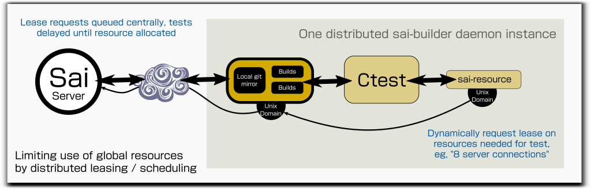

# Sai Resource Manager

Once you have many builds running under sai, a serious danger is that
the tests may effectively DDoS any resources they need, like remote
servers.  There may be dozens of builders each running builds and the
tests themselves concurrently, at any given moment this may cause
spikes of hundreds or thousands of simultaneous outgoing connections.

To avoid this, Sai builds in a generic, configurable "resource manager"
in sai-server that is a central place that allocates and queues
requests for leases on amounts of abstract "resources".  The actual
resources don't need to be on the server or be physical, so long as
whatever wants to use them participates in the resource management
action via the server.



## Configuring well-known resources at sai-server

The sai-server instance is told about "well-known" resources it is
managing in the sai-server vhost config as a pvo of the
"com-warmcat-sai" protocol named `resources`, eg in
`/etc/sai/server/conf.d/libwebsockets.org`

```
...
	"ws-protocols": [{
        	"com-warmcat-sai": {
...
			"resources":    "warmcat_conns=32"
		}
...
```

It takes a comma-separated list in the form of `resource_name=budget`,
the `budget` is the total amount of that resource that may be in use
concurrently.

## Request architecture

At the top of the architecture is the centralized resource manager in
sai-server, the sources of the requests for these resources are the
indiviudal tests that require the resources to operate and must block
until they are allocated the resource.

Since there may be other tests that can run concurrently when these
resources are not available, requesting the resources at the level of
the individual tests can be considerably more efficient.  Eg ctest
routinely runs at high levels of test concurrency and so can take
advantage of this.  It also allows the amount of the resource being
requested to be tailored to the individual test usage cleanly.

In the ctest case, tests that require resources define a dependency on
one or more sub-tests that make the resource requests, it is this
dependency that blocks until the resource is made available to it (or
the request fails).

## `sai-resource`

`sai-resource` is the interface at the builder.  To make sure the
sai-server is scalable, instead of opening its own connection to the
sai-server instance, the sai-builder proxies its existing connection
via a Unix Domain Socket and `sai-resource` connects to that.

You give it the following arguments to describe what you want

|argument|example|meaning|
|---|---|---|
|1|warmcat_conns|Well-known resource name|
|2|8|Number of resources needed|
|3|20|Seconds to lease the resources|

First it creates a random cookie and sends that along with the resource
request to sai-builder, which passes it up to the sai-server to be
queued; the `sai-resource` instance blocks until the resource is
allocated (returning 0) or it times out waiting (returning 1).

```
[sai-resource] - [ctest] - [sai-builder] - [sai-server]
```

If the resource is allocated, `sai-resource` forks and unblocks the
caller while leaving a fork connected to the Unix Domain Socket, this
allows the `sai-builder` it is connected to to be aware when the test
completed and release the resources at sai-server immediately.

